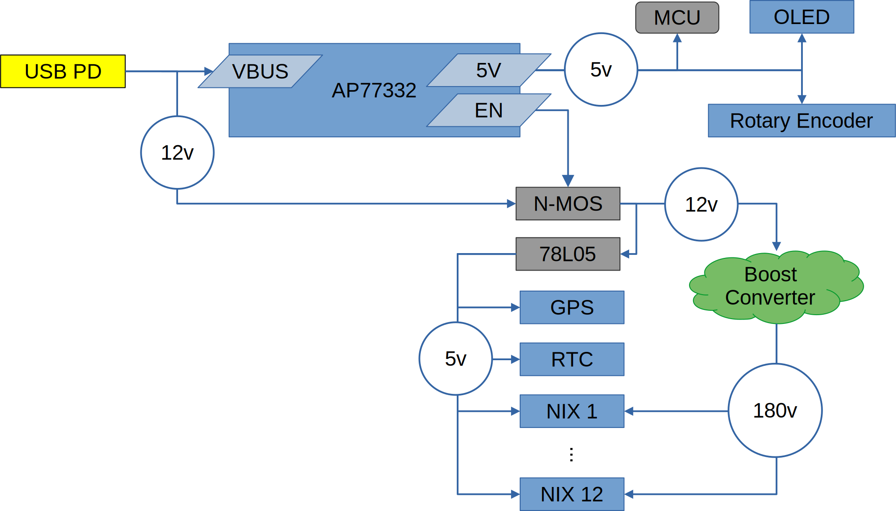

# Yet Another Nixie Clock

## Introduction

This is my Nixie clock project. It was created as an excuse to learn more about electronics and it touches on power circuits, microcontrollers, serial communications, and more.

The clock runs 12 IN-12A Nixie tubes that display the time and date. INS-1 tubes are used for digit separators. It also includes:
- USB-C PD power input
- Boost converter to provide 180V for the nixie tubes
- GPS module for date/time synchronization
- User-selectable timezone
- RTC module for precision timekeeping, and power-off timekeeping
- 128x32 mono OLED display for diagnostics
- Rotary encoder for user input
- I2C Driver boards for each tube

## Architecture

### Main Processor
A Microchip PIC16F15224 8-bit microcontroller is the main processing unit of the clock. It controls the boost converter while managing and coordinating the other hardware modules.

### Power

A Diodes Incorporated AP33772 is used to negotiate with a PD source for the input power. The AP33772 is controlled by the main MCU via I2C. The AP33772 requests 12V from the power source, which supplies the boost converter.

The AP33772 also provides a dedicated 5V power source. This is a low amperage source, so it is only used to drive the MCU and UI. A separate 78L05 regulator (powered by the 12V from USB VBUS) provides 5V power to all of the other devices.

Finally, the AP33772 provides over-current and over-voltage protection features.

### User Interface
A 128x32 OLED display (driven by an SSD1306) is used to display status and diagnostics information. A rotary encoder with detent is used to scroll through the different display pages, and to select timezone and DST support. The OLED pixel data is sent over I2C.

### Real Time Clock
An RTC module provides an accurate time source for the clock. It is the source of the time/date displayed and is only updated if it differs from the GPS time. The RTC module is also equiped with a battery backup. This allows the clock to display time/date immediately after power-on instead of having to wait several minutes for valid GPS data. RTC data is sent over I2C.

### GPS
The GPS module provides a reference time to initialize the RTC. The module streams standard NMEA messages to the primary MCU over UART serial. Time/date are decoded from these messages.

### Nixie Drivers
Each Nixie tube has a driver board. This board has a Microchip PIC16F15243 MCU in I2C client mode receiving commands from the primary MCU. This client MCU drives the Nixie pins and provides features such as digit cross-fading and cathode maintenance.

## Project Components

### ClockController

This is the main controller board. It connects to a header on the back of the display board and has these main components:
- Primary MCU
- USB PD components
- Boost converter circuitry
- User Interface

### Hardware / Display Board

This board servers as the main support structure of the clock. The Nixie drivers connect to headers on the front of the board. The controller board, GPS, and RTC all connect to the back of the board.

### NixieDriver

The driver board for each individual IN-12 Nixie tube.

### NixieDriverTester

This is a stand-alone test board that will power and exercise a single NixieDriver and tube. It is used for QA of assembled driver boards and testing of the NixieDriver firmware.

### Hardware / Nixie Driver ICSP Adapter

A small board that attaches to a NixieDriver and provides a pin-out compatible with a PICKIT 5 programmer for In Circuit Serial Programming.

### Hardware / Separator

A tiny board that adapts the physical interface of the INS-1 tubes used as digit separators.